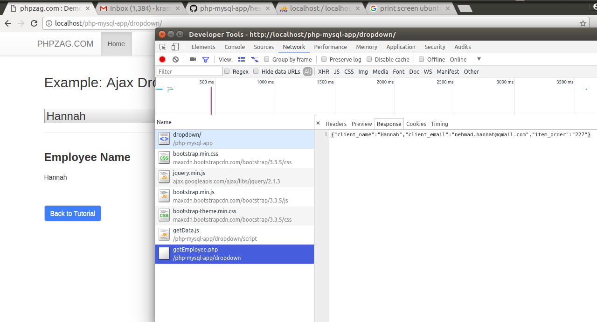
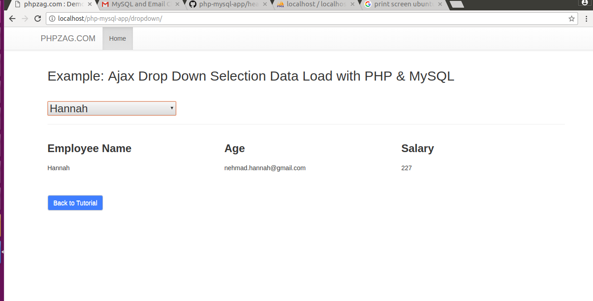

To start the app simply 

a) create 2 sql databases locally
b) put a password in the 'database.php' file, "dropdown/db_connect.php" file, and "drag-and-drop/config.php" file.

c) Run this command on the db to add an 'item_order' column

query to add the 'item_order' column to client table.

ALTER TABLE client ADD item_order int(11) NOT NULL; 

The app uses MySQL, PHP, and Ajax.

<h3>A note about the dropdown features:</h3>

The Dropdown action triggers the Ajax script in 'dropdown/script/getData.js'

Currently, it's fetching stuff from getemployee.php.

This response be found in Chrome's 'Network' Tab. The subsection is called "Response".

This data is then displayed unto the page via the Ajax Function in 'dropdown/script/getData.js'

<h3>Chrome's Network tab for handling request/response processes</h3>

<h3>Demo</h3>

